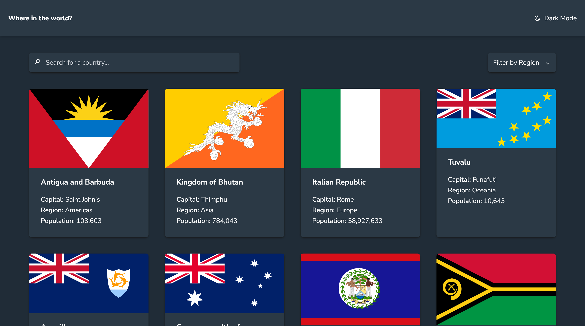

# Frontend Mentor - REST Countries API with color theme switcher solution

This is a solution to the [REST Countries API with color theme switcher challenge on Frontend Mentor](https://www.frontendmentor.io/challenges/rest-countries-api-with-color-theme-switcher-5cacc469fec04111f7b848ca). Frontend Mentor challenges help you improve your coding skills by building realistic projects. 

## Table of contents

- [Overview](#overview)
  - [The challenge](#the-challenge)
  - [Screenshot](#screenshot)
  - [Links](#links)
- [My process](#my-process)
  - [Built with](#built-with)
  - [What I learned](#what-i-learned)
- [Author](#author)

## Overview

### The challenge

Users should be able to:

- See all countries from the API on the homepage
- Search for a country using an `input` field
- Filter countries by region
- Click on a country to see more detailed information on a separate page
- Click through to the border countries on the detail page
- Toggle the color scheme between light and dark mode *(optional)*

### Screenshot



### Links

- Solution URL: [Click here](https://github.com/telemoca/countries-api)
- Live Site URL: [Click here](https://countries-api-beige-five.vercel.app/)

## My process

### Built with

- HTML5
- CSS custom properties
- Flexbox
- CSS Grid
- [Tailwind](https://tailwindcss.com/)
- [ESLint](https://eslint.org/)
- [Typescript](https://www.typescriptlang.org/)
- [Nuxt 4](https://nuxt.com/) - The Progressive Web Framework

### What I learned

I learned how to use Nuxt, and deepened my knowledge of TS

I learned how to remove nullish variables from an array with `.filter(Boolean)`
```ts
const splitted_research = user_research
        .toLowerCase()
        .split(" ")
        .filter(Boolean)
```

## Author

- Frontend Mentor - [@telemoca](https://www.frontendmentor.io/profile/telemoca)